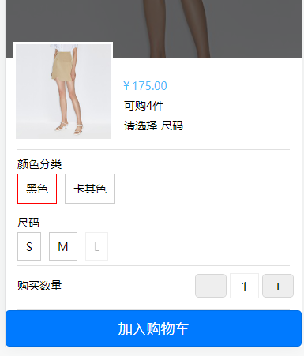

# 关键代码总结

## 全局通用样式管理

`uni.scss`文件的用途是为了方便整体控制应用的风格。比如按钮颜色、边框风格，`uni.scss`文件里预置了一批`scss`变量预置。

利用`uni.scss`的自动注入，就不用自己配置自己的全局`scss`文件，进而配置通用的一些属性，比如字体颜色、背景颜色、文字大小等，还可以定义通用的`mixin`，比如文本省略等，在满足设计稿前提下，使得后期更换主题颜色更加方便。

```scss
/* 主题色 */
$app-color-primary: #49BDFB;
$app-color-red: #f44336;
$app-color-grey: #f6f6f6;
/* 文字 */
$app-text-info: #333;
$app-text-info-2: #666;
$app-text-info-3: #999;

/* 文本省略 */
@mixin ellipsis-line($line:2){
  overflow: hidden;
  -webkit-line-clamp: $line;
  text-overflow: ellipsis;
  display: -webkit-box;
  -webkit-box-orient: vertical;
}
```

## request请求封装

​	在发送请求时，我们直接使用`uni.request()`，往往不够灵活。`uni.request()`默认是回调语法，不支持Promise，而且如果直接使用，请求需要重复编写许多冗余的配置信息，因此，我们可以进行一层封装增强。

​	增强封装有利于请求的通用设置与拦截，更方便让我们控制请求时通用加载样式、请求的状态码处理，以及一些通用的鉴权处理。

​	本项目只做了最简单的请求处理，实际业务中，还需要封装通用拦截方法，处理请求响应协定的状态码信息。

```js
// request.js

// 匹配环境，请求api（方便开发）
let BASE_URL = null
if (process.env.NODE_ENV === 'development') {
	BASE_URL = 'http://localhost:3002'
} else {
	BASE_URL = 'http://81.71.88.2:3002'
}

export default {
    // 通用配置
	common:{
		baseUrl: BASE_URL + "/shop", // 请求的基本路径
		data:{},
		header:{
			"Content-Type":"application/json",
			"Content-Type":"application/x-www-form-urlencoded"
		},
		method:"GET",
		dataType:"json"
	},
	request( options={} ){
        // 全局加载状态
		uni.showLoading({
		    title: '加载中'
		});
		// 覆盖配置
		options.url = this.common.baseUrl + options.url;
		options.data = 	options.data || this.common.data;
		options.header = options.header || this.common.header;
		options.method = options.method || this.common.method;
		options.dataType = 	options.dataType || this.common.dataType;
		// query的传参处理
		if(options.query) {
			const queryArr = [];
			Object.keys(options.query).forEach((key)=>{
				queryArr.push(key + '=' + options.query[key])
			})
			if(queryArr.length > 0) {
				options.url += '?' + queryArr.join('&')
			}
		}
        // Promise封装
		return new Promise((resolve,reject)=>{
			uni.request({
				...options,
				success: (result) => {
					uni.hideLoading();
					if(result.statusCode != 200){
						uni.showToast({
							mask: true,
							icon: 'error',
							title: '请求出错!',
						})
						return reject();
					}
					let data = result.data.data;
					resolve(data);
				}
			})
		})
	}
}
```

## 页面刷新与加载

​	`uniapp`开发应用十分方便，因为许多业务开发上的东西，几乎都被`uniapp`封装成了匹配三端的组件了，所以页面下拉刷新与上拉加载相关业务，也从从前移动端繁琐的处理，根据页面类型，可以通过生命周期的配置和`scroll-view`进行处理。此处只写出关键代码，说明用法。

### 页面级下拉刷新/上拉加载

`pages.json`

```json
{
    "pages": [
        {
        	"path": "pages/index",
        	"style": {
        		// ...
        		"enablePullDownRefresh": true // 开启下拉刷新
        	}
        }
    ],
}

```

``index.vue``

```js
// 仅做示例，实际开发中延时根据需求来使用。
export default {
    // 下拉刷新
	onPullDownRefresh() {
		console.log('refresh');
		setTimeout(function () {
			uni.stopPullDownRefresh();
		}, 1000);
	},
    // 上拉加载
    onReachBottom(){
        // 到达页面底部
        // 请求加载更多数据
    }
}
```

### 容器下拉刷新/上拉加载

​	往往业务中，有许多不是页面级展示的，比如说本项目的首页中的tab标签页类型，因为业务需求，每个标签页的包裹容器高度是固定的，而实际变化高度的是容器中的子容器，用于展示内容。滚动也是滚动包裹容器这个视窗的内容，所以无法触发页面级的生命周期钩子。

此时，`uniapp`给我们提供一个视窗容器` <scroll-view>`可滚动视图区域。用于区域滚动，专门解决此类问题，此组件也给出了方案。

示例代码：

`template`

```vue
<view>
    <scroll-view 
		scroll-y="true"
        refresher-enabled="true"
        :refresher-triggered="triggered"
         @refresherrefresh="onRefresh"
         @scrolltolower="onReachBottom"
	>
        // 内容
	</scroll-view>
</view>
```

`scripts`

```js
export default {
    data(){
        return {
            triggered: false， // 下拉加载状态
        }
    }
    methods: {
    	// 下拉刷新
        onRefresh(){
			// ...
        },
        // 上拉加载
        onReachBottom(){
            // ...
        }
    }
}
```


## 多规格商品SKU选择实现

​	在商城项目中，多规格商品的选择是必不可少的，也是相对比较复杂的一项业务功能。在这项功能中，也有许多写法。在本项目中，使用最简单的直接遍历实现了该功能，后续优化会思考如何利用算法，来进行该项业务功能的优化。



### 相关数据格式

```json
// 商品sku
"skuInfo": [
    {
        "id": "1599207",
        "attributeIds": [
            "13595",
            "12934"
        ],
        "price": 175.0,
        "oriPrice": 439.0,
        "stockCount": 2
    },
    {
        "id": "1599208",
        "attributeIds": [
            "13595",
            "12935"
        ],
        "price": 175.0,
        "oriPrice": 439.0,
        "stockCount": 2
    },
    {
        "id": "1599209",
        "attributeIds": [
            "13595",
            "12937"
        ],
        "price": 175.0,
        "oriPrice": 439.0,
        "stockCount": 0
    },
    {
        "id": "1599210",
        "attributeIds": [
            "13639",
            "12934"
        ],
        "price": 175.0,
        "oriPrice": 439.0,
        "stockCount": 0
    },
    {
        "id": "1599211",
        "attributeIds": [
            "13639",
            "12935"
        ],
        "price": 175.0,
        "oriPrice": 439.0,
        "stockCount": 2
    },
    {
        "id": "1599212",
        "attributeIds": [
            "13639",
            "12937"
        ],
        "price": 175.0,
        "oriPrice": 439.0,
        "stockCount": 0
    }
],
// 属性skuid对应的属性
"attributes": [
    {
        "id": "104",
        "name": "颜色分类",
        "values": [
            {
                "id": "13595",
                "value": "黑色",
                "imgUrl": "",
            },
            {
                "id": "13639",
                "value": "卡其色",
                "imgUrl": "",
            }
        ]
    },
    {
        "id": "124",
        "name": "尺码",
        "values": [
            {
                "id": "12934",
                "value": "S",
                "imgUrl": "",
            },
            {
                "id": "12935",
                "value": "M",
                "imgUrl": "",
            },
            {
                "id": "12937",
                "value": "L",
                "imgUrl": "",
            }
        ]
    }
],
```

### 直接遍历法实现

#### 模拟数据概览：

```
属性1：颜色分类
可选sku：黑色，卡其色

属性2：尺寸
可选sku：S，M, L
```

#### 期望目标：

- 未选择时，显示总库存
- 选择任意sku属性
  1. 计算当前属性所有库存
  2. 库存为0的sku选项置灰。

#### 编码思路：

1. 每次点击sku选项，触发`onSkuChange`事件
2. 获取点击的 sku选项，sku属性id定为`id`，sku所属的属性id定为`pid`。
3. 循环遍历所有该产品的属性，除了当前选择的属性，初始化所有其它属性的sku选项的`选择状态`。
4. 从`skuInfo`表中，查询所有拥有当前选择的sku属性的sku商品。
5. 如果商品库存为0，将对应的sku选项置灰。

#### 关键代码展示：

```js
// sku计算
// 暴力循环法
onSkuChange(pid){
    const id = this.skuSelect[pid]; // 当前选中大类中的子sku的id

    // 初始化所有标签状态
    this.product.attributes.forEach((parentAttr)=>{
        if(parentAttr.id != pid) {
            parentAttr.values.forEach(attr => {
                attr.disabled = false;
            })
        }
    })
    if(id !== null) {
        // 找到包含目标id的skuinfo
        const allChoice = this.product.skuInfo.filter((item) => item.attributeIds.find(attributeId => attributeId == id))
        // 找到无库存所有属性
        const otherIds = []
        allChoice.forEach((item)=>{
            // 标记找到无库存的id
            if(item.stockCount === 0) {
                otherIds.push(...item.attributeIds.filter((attributeId) => attributeId !== id));
            }
        })
        // 将无库存属性置灰
        this.product.attributes.forEach((parentAttr)=>{
            if(parentAttr.id != pid) {
                parentAttr.values.forEach(attr => {
                    if(otherIds.indexOf(attr.id) !== -1){
                        // 找到该属性, 标记为不可选状态
                        attr.disabled = true;
                    }
                })
            }
        })
    }
},
```


