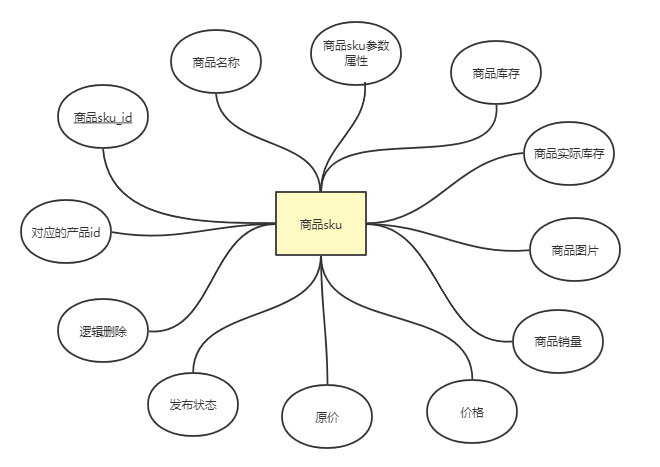

# 商品模块表设计

## 产品表

### 产品表 ER 图


#### 关键数据说明

- 商家店铺编号：关联新增该产品店铺id，产品由商家的店铺管理

- 品牌编号：可以为空，没有品牌

  一些散装的可能没有品牌，比如花生之类的

- 分类编号：关联分类，用于产品分类检索。

  比如：属于手机类，会在手机分类下面查询得到该商品。

- 参数属性：关联产品所选的参数属性，形成sku。

  比如：iphone8产品拥有的属性：

  - 颜色

    黑、白、蓝

  - 内存

    128G 256G 1TB

  获取的商品详情时，可以通过该属性，查询所有可选的sku参数，然后用于页面可选选项的显示。

  > 表优化：如果想增加一些商品的常规规格属性，而又不想每次都添加时，可以增加一个品类表通过关联品类来设置通用属性。比如说衣服品类，都需要设置面料，规格尺寸，厂家等属性，可以通过品类进行约束设置。

### 产品表数据结构图


#### 建表语句

```mysql
CREATE TABLE `t_prod` (
  `id` bigint(20) unsigned NOT NULL AUTO_INCREMENT COMMENT '产品id',
  `shop_id` bigint(20) unsigned DEFAULT NULL COMMENT '所属商家店铺',
  `brand_id` bigint(20) unsigned DEFAULT NULL COMMENT '所属品牌id',
  `category_id` bigint(20) unsigned DEFAULT NULL COMMENT '所属分类id',
  `name` varchar(300) NOT NULL COMMENT '产品名称',
  `title` varchar(300) DEFAULT NULL COMMENT '产品标题',
  `sub_title` varchar(300) DEFAULT NULL COMMENT '产品副标题',
  `picture` json DEFAULT NULL COMMENT '产品主图',
  `images` json DEFAULT NULL COMMENT '产品图片集',
  `description` varchar(500) DEFAULT NULL COMMENT '产品简介',
  `content` json DEFAULT NULL COMMENT '产品详细描述',
  `price` decimal(15,2) DEFAULT NULL COMMENT '产品现价',
  `ori_price` decimal(15,2) DEFAULT NULL COMMENT '产品原价',
  `attrs` json DEFAULT NULL COMMENT '产品可选的属性',
  `status` tinyint(1) unsigned DEFAULT '0' COMMENT '发布状态(0:未上架(默认),1:已上架)',
  `is_deleted` tinyint(1) unsigned DEFAULT '0' COMMENT '逻辑删除(0:正常(默认), 1:已删除)',
  `putaway_time` datetime DEFAULT NULL COMMENT '产品上架时间',
  `gmt_create` datetime DEFAULT CURRENT_TIMESTAMP COMMENT '记录时间',
  `gmt_modified` datetime DEFAULT CURRENT_TIMESTAMP ON UPDATE CURRENT_TIMESTAMP COMMENT '更新时间',
  PRIMARY KEY (`id`)
) ENGINE=InnoDB DEFAULT CHARSET=utf8

```


## 商品表

### 商品表ER图




### 产品表数据结构图


#### 建表语句

```mysql
CREATE TABLE `t_sku` (
  `id` bigint(20) unsigned NOT NULL AUTO_INCREMENT COMMENT 'sku商品id',
  `prod_id` bigint(20) unsigned NOT NULL COMMENT '所属产品的id',
  `sku_name` varchar(200) DEFAULT NULL COMMENT 'sku商品名称',
  `sku_attrs` json DEFAULT NULL COMMENT '销售属性组合json 格式是{a1:v1;a2:v2}',
  `price` decimal(15,2) DEFAULT NULL COMMENT '商品现价',
  `ori_price` decimal(15,2) DEFAULT NULL COMMENT '商品原价',
  `stock` int(11) DEFAULT NULL COMMENT '商品在付款减库存的状态下，该sku上未付款的订单数量',
  `actual_stock` int(11) DEFAULT NULL COMMENT '实际库存',
  `sold_num` int(11) DEFAULT NULL COMMENT '单品销量',
  `picture` json DEFAULT NULL COMMENT '单品主图',
  `status` tinyint(1) DEFAULT '0' COMMENT '发布状态(0:未上架(默认),1:已上架)',
  `is_deleted` tinyint(1) unsigned DEFAULT '0' COMMENT '逻辑删除(0:正常(默认), 1:已删除)',
  `putaway_time` datetime DEFAULT NULL COMMENT '单品上架时间',
  `gmt_create` datetime DEFAULT CURRENT_TIMESTAMP COMMENT '创建时间',
  `gmt_modified` datetime DEFAULT CURRENT_TIMESTAMP ON UPDATE CURRENT_TIMESTAMP COMMENT '更新时间',
  PRIMARY KEY (`id`)
) ENGINE=InnoDB DEFAULT CHARSET=utf8

```


## 属性表

### ER图


#### 关键数据说明

- 参数类型：规格 OR 参数属性

  规格类型是不可选择的，而参数类型是供sku使用。

- 店铺id:

  参数由店铺创建，可以用于所有店铺内的产品。


### 数据结构图


#### 建表语句

```mysql
CREATE TABLE `t_prod_attr` (
  `id` bigint(20) unsigned NOT NULL AUTO_INCREMENT COMMENT '属性id',
  `shop_id` bigint(20) unsigned NOT NULL COMMENT '所属店铺id',
  `attr_name` varchar(50) DEFAULT NULL COMMENT '属性名称',
  `rule` tinyint(2) DEFAULT '1' COMMENT '1:销售属性(规格); 2:参数属性;',
  `is_deleted` tinyint(1) unsigned DEFAULT '0' COMMENT '逻辑删除(0:正常(默认), 1:已删除)',
  `gmt_create` datetime DEFAULT CURRENT_TIMESTAMP COMMENT '创建时间',
  `gmt_modified` datetime DEFAULT CURRENT_TIMESTAMP ON UPDATE CURRENT_TIMESTAMP COMMENT '更新时间',
  PRIMARY KEY (`id`)
) ENGINE=InnoDB DEFAULT CHARSET=utf8
```


## 属性值表

### ER图


### 数据结构图


#### 建表语句

```mysql
CREATE TABLE `t_prod_attr_value` (
  `id` bigint(20) unsigned NOT NULL AUTO_INCREMENT COMMENT '属性值的id',
  `attr_id` bigint(20) unsigned NOT NULL COMMENT '所属属性参数id',
  `attr_value` varchar(50) DEFAULT NULL COMMENT '属性值',
  `is_deleted` tinyint(1) unsigned DEFAULT '0' COMMENT '逻辑删除(0:正常(默认), 1:已删除)',
  `gmt_create` datetime DEFAULT CURRENT_TIMESTAMP COMMENT '创建时间',
  `gmt_modified` datetime DEFAULT CURRENT_TIMESTAMP ON UPDATE CURRENT_TIMESTAMP COMMENT '更新时间',
  PRIMARY KEY (`id`)
) ENGINE=InnoDB DEFAULT CHARSET=utf8
```


## 关键业务设计与说明

### SKU商品如何产生？

​	在商家后台管理系统中，当商家新增产品时，需要管理产品对应的SKU商品，完成新增后将SKU商品信息（此处接口参数名设为`skuList`）一并发送到`addProduct`相关业务接口中。

此时接口处理逻辑：

1. 插入新产品信息至`t_prod`表 

2. 查询接口传入的prod_id，查询数据库中所有当前产品的sku的ID，存入`dbSkuIds`的集合中

3. 将接口获取的`skuList`参数进行过滤，并遍历将数据插入sku表，存在一下处理情况

   - `skuItem`（`skuItem`为接口传入的`SkuList`遍历出来的单列数据）存在id属性，查询`dbSkuIds`是否存在该id

     - 存在id，则将该列数据更新至指定id的数据库记录中
     - 不存在id，插入该列数据

   - `skuItem`不存在id

     插入该列数据


### 如何获取sku选项？

​	在商城端商品详情，需要sku选项展示，并提供给用户选择指定的单品加入购物车，此时需要通过产品字段`attrs`字段，通过`attr`的`id`在`t_prod_attr`表中所有可选参数，然后再通过`t_prod_attr_value`查询出所有可选sku选项，把数据整合渲染到商城的供用户选择。


### 如何默认选择sku选项？

​	点击sku单品进入详情页后，根据`sku_id`查询sku商品信息，再通过`t_sku`表的`sku_attrs`，提取出当前商品对应的sku属性，并让选项高亮。


### 如何获取产品的总销量和总库存？

#### 方案一：创建派生视图（不推荐）


建表语句：

```mysql
SELECT prod_id, SUM(stock) AS `total_stock`, sold_num 
FROM `tz_sku` 
WHERE `is_delete` = 0 AND `status` = 1 
GROUP BY prod_id 
```

> 说明：该视图表由sku表派生，用作产品的总销量和总库存查询业务
>
> 不推荐的原因：
>
> 1.由于查询视图会执行相应的查询代码，导致效率下降。
>
> 2.视图/存储过程都应该通过编写程序代码替代，使用程序应用编写可以缓存数据结果，减少查询次数，所以更灵活更利于后期维护。


#### 方案二：业务代码中执行查询，通过sku表进行查询相关数据（推荐）

```mysql
SELECT SUM(stock) AS `total_stock`, sold_num 
FROM `t_sku` 
WHERE prod_id = `[目标prod_id]` AND `is_delete` = 0 AND `status` = 1 # 排除删除和未上架状态商品
GROUP BY prod_id 
```


