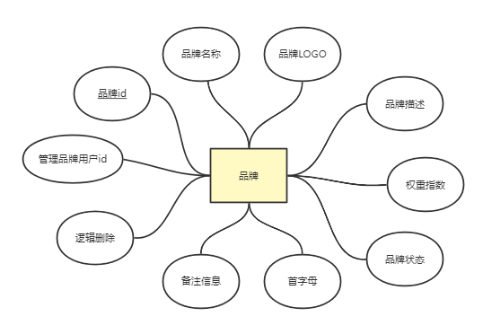
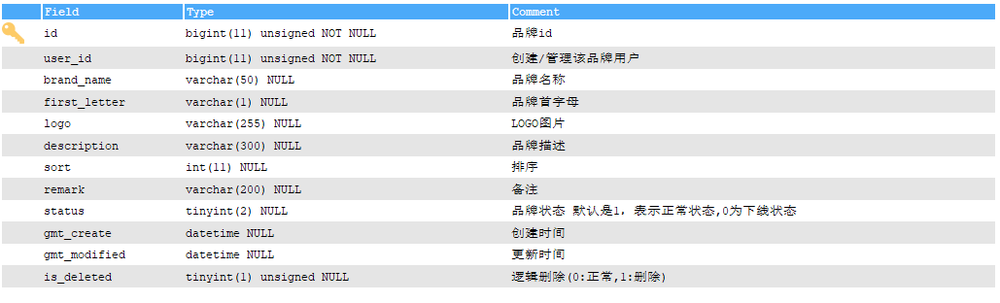
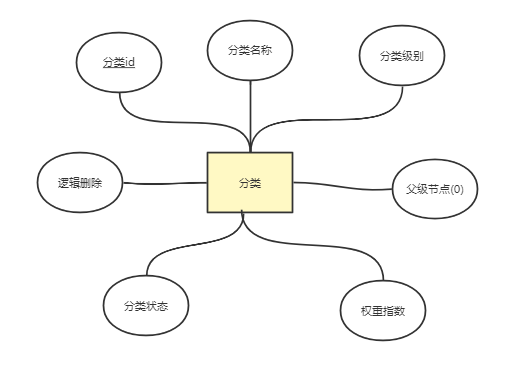
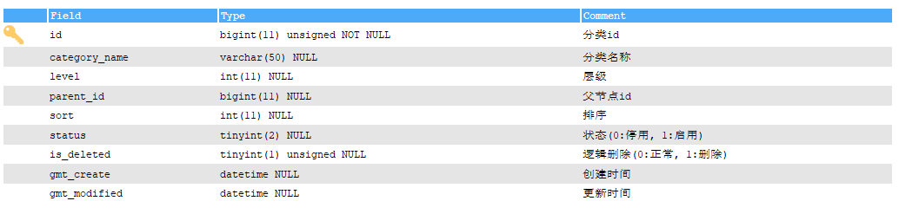
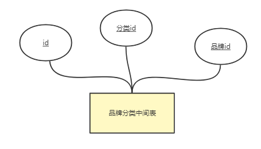
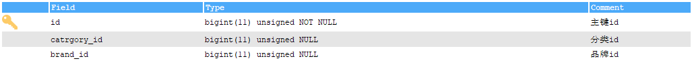

# 设计品牌与分类表

## 品牌表

### ER图




#### 关键数据说明

- 权重指数：用于排序/搜索
- 品牌状态： 0：下线, 1：正常(默认)
- 首字母：用于字母检索
- 备注：后台管理使用，备注说明该品牌管理的信息

### 数据结构实体图



#### 建表语句

```mysql
CREATE TABLE `t_brand` (
  `id` bigint(11) unsigned NOT NULL AUTO_INCREMENT COMMENT '品牌id',
  `user_id` bigint(11) unsigned NOT NULL COMMENT '创建/管理该品牌用户',
  `brand_name` varchar(50) DEFAULT NULL COMMENT '品牌名称',
  `first_letter` varchar(1) DEFAULT NULL COMMENT '品牌首字母',
  `logo` varchar(255) DEFAULT NULL COMMENT 'LOGO图片',
  `description` varchar(300) DEFAULT NULL COMMENT '品牌描述',
  `sort` int(11) DEFAULT NULL COMMENT '排序',
  `remark` varchar(200) DEFAULT NULL COMMENT '备注',
  `status` tinyint(2) DEFAULT NULL COMMENT '品牌状态 默认是1，表示正常状态,0为下线状态',
  `gmt_create` datetime DEFAULT CURRENT_TIMESTAMP COMMENT '创建时间',
  `gmt_modified` datetime DEFAULT CURRENT_TIMESTAMP ON UPDATE CURRENT_TIMESTAMP COMMENT '更新时间',
  `is_deleted` tinyint(1) unsigned DEFAULT '0' COMMENT '逻辑删除(0:正常,1:删除)',
  PRIMARY KEY (`id`)
) ENGINE=InnoDB DEFAULT CHARSET=utf8

```


## 分类表

### ER图




### 数据结构实体图



#### 建表语句

```mysql
CREATE TABLE `t_category` (
  `id` bigint(11) unsigned NOT NULL AUTO_INCREMENT COMMENT '分类id',
  `category_name` varchar(50) DEFAULT NULL COMMENT '分类名称',
  `level` int(11) DEFAULT NULL COMMENT '层级',
  `parent_id` bigint(11) DEFAULT NULL COMMENT '父节点id',
  `sort` int(11) DEFAULT NULL COMMENT '排序',
  `status` tinyint(2) DEFAULT NULL COMMENT '状态(0:停用, 1:启用)',
  `is_deleted` tinyint(1) unsigned DEFAULT '0' COMMENT '逻辑删除(0:正常, 1:删除)',
  `gmt_create` datetime DEFAULT CURRENT_TIMESTAMP COMMENT '创建时间',
  `gmt_modified` datetime DEFAULT CURRENT_TIMESTAMP ON UPDATE CURRENT_TIMESTAMP COMMENT '更新时间',
  PRIMARY KEY (`id`)
) ENGINE=InnoDB DEFAULT CHARSET=utf8

```


## 分类品牌关联表

### 表说明

分类品牌是多对多关系，分类下有n个品牌， 品牌下也可以有n个分类，所以要互相查询就需要一个中间表进行管理和查询，避免过度冗余的数据。

### ER图



### 数据结构实体图



```mysql
CREATE TABLE `t_category_brand` (
  `id` bigint(11) unsigned NOT NULL AUTO_INCREMENT COMMENT '主键id',
  `catrgory_id` bigint(11) unsigned DEFAULT NULL COMMENT '分类id',
  `brand_id` bigint(11) unsigned DEFAULT NULL COMMENT '品牌id',
  PRIMARY KEY (`id`)
) ENGINE=InnoDB DEFAULT CHARSET=utf8 COMMENT='分类与品牌中间表'
```

