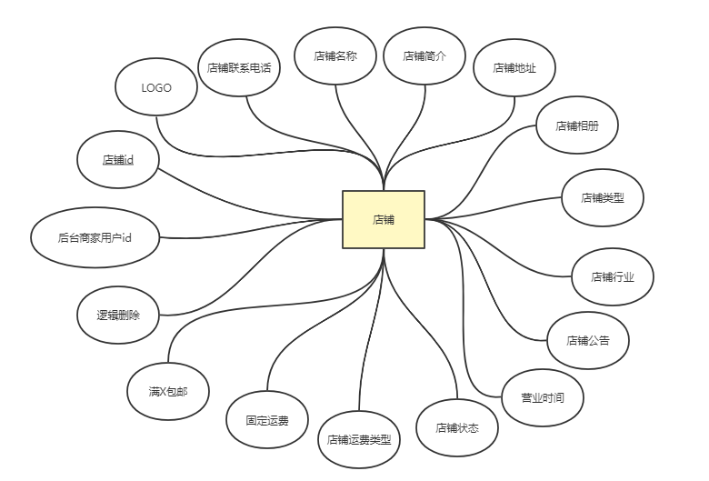
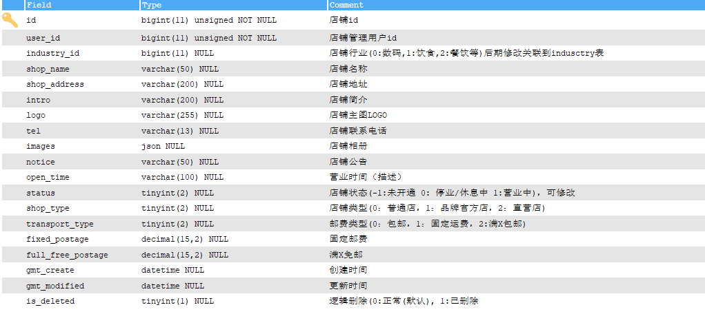

# 设计店铺表

## 店铺表

### ER图



#### 关键数据说明

- 店铺类型：

  0：普通店，1：品牌官方店，2：直营店

- 店铺行业：用于搜索

  设置该字段，可以在搜索店铺类型时，根据行业检索出店铺（如餐饮、生鲜果蔬、鲜花等）

- 店铺状态：

  -1：未开通 ，0：休息中，1：营业中

- 店铺运费类型：

  0：包邮，1：固定运费，2:满X包邮

- 满X包邮：

  满指定额包邮

### 数据结构图



#### 建表语句

```mysql
CREATE TABLE `t_shop` (
  `id` bigint(11) unsigned NOT NULL AUTO_INCREMENT COMMENT '店铺id',
  `user_id` bigint(11) unsigned NOT NULL COMMENT '店铺管理用户id',
  `industry_id` bigint(11) DEFAULT NULL COMMENT '店铺行业(0:数码,1:饮食,2:餐饮等)后期修改关联到indusctry表',
  `shop_name` varchar(50) DEFAULT NULL COMMENT '店铺名称',
  `shop_address` varchar(200) DEFAULT NULL COMMENT '店铺地址',
  `intro` varchar(200) DEFAULT NULL COMMENT '店铺简介',
  `logo` varchar(255) DEFAULT NULL COMMENT '店铺主图LOGO',
  `tel` varchar(13) DEFAULT NULL COMMENT '店铺联系电话',
  `images` json DEFAULT NULL COMMENT '店铺相册',
  `notice` varchar(50) DEFAULT NULL COMMENT '店铺公告',
  `open_time` varchar(100) DEFAULT NULL COMMENT '营业时间（描述）',
  `status` tinyint(2) DEFAULT NULL COMMENT '店铺状态(-1:未开通 0: 停业/休息中 1:营业中)，可修改',
  `shop_type` tinyint(2) DEFAULT NULL COMMENT '店铺类型(0：普通店，1：品牌官方店，2：直营店)',
  `transport_type` tinyint(2) DEFAULT NULL COMMENT '邮费类型(0：包邮，1：固定运费，2:满X包邮)',
  `fixed_postage` decimal(15,2) DEFAULT NULL COMMENT '固定邮费',
  `full_free_postage` decimal(15,2) DEFAULT NULL COMMENT '满X免邮',
  `gmt_create` datetime DEFAULT CURRENT_TIMESTAMP COMMENT '创建时间',
  `gmt_modified` datetime DEFAULT CURRENT_TIMESTAMP ON UPDATE CURRENT_TIMESTAMP COMMENT '更新时间',
  `is_deleted` tinyint(1) unsigned DEFAULT '0' COMMENT '逻辑删除(0:正常(默认), 1:已删除',
  PRIMARY KEY (`id`)
) ENGINE=InnoDB DEFAULT CHARSET=utf8 COMMENT='店铺表'

```

