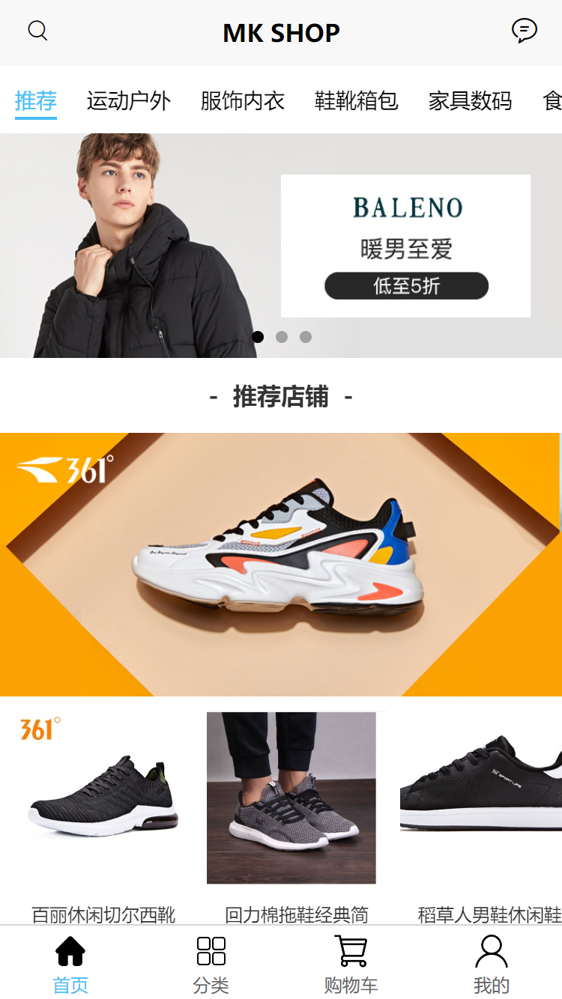
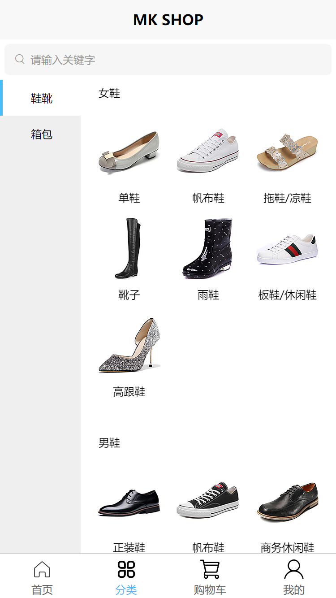
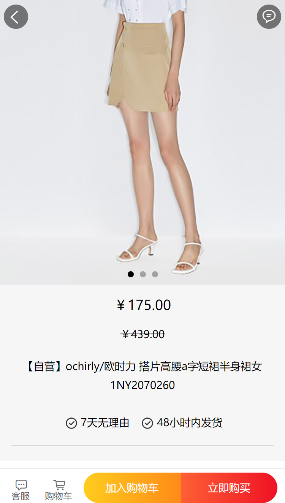
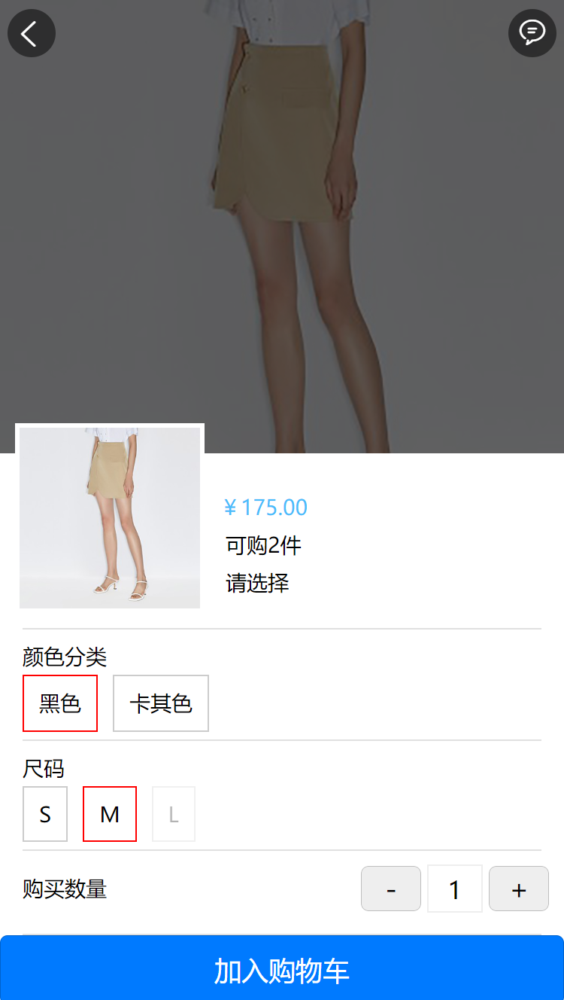
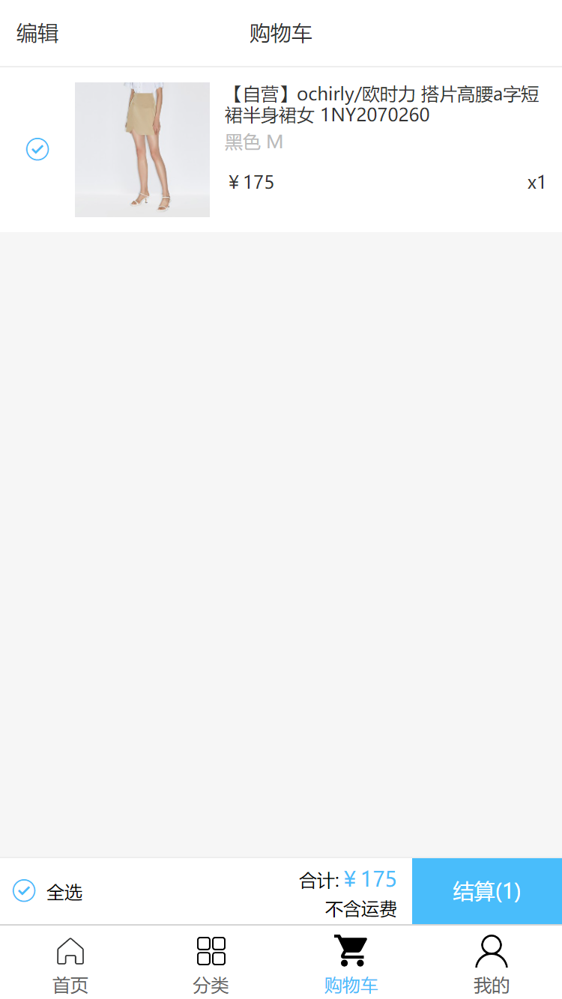
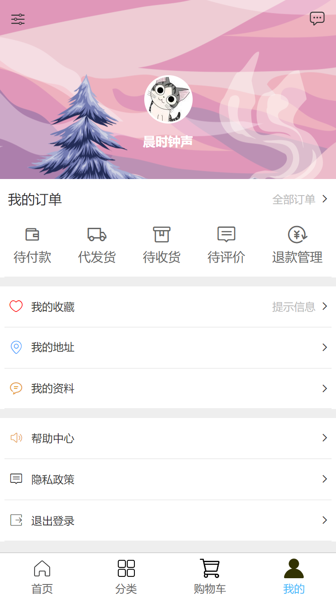

## 项目简介

`mk-shop`项目致力于为打造一个完整、易于维护的商城系统，目前项目为前端部分，前端采用现阶段流行框架Uniapp技术实现，兼容H5、微信小程序以及App三端。项目现阶段完成项目的需求分析，并且完成前端部分功能展示，并以此用作个人作品展示。

## 技术选型

| 技术      | 版本    | 说明                                                 |
| --------- | ------- | ---------------------------------------------------- |
| vue.js    | 2.6.7   | 用于构建用户界面的渐进式前端框架                     |
| uni-app   | 3.4.18  | 使用Vue.js开发兼容各端的前端应用的框架。             |
| sass/scss | 0.0.7   | Sass/Scss 是一款强化 CSS 的辅助工具。                |
| node.js   | 14.16.0 | Node.js 是一个开源和跨平台的 JavaScript 运行时环境。 |

## 项目演示

mk-shop 前端线上演示链接: [点击访问](http://81.71.88.2:8100/)

- 扫码访问

    

        <strong>H5端</strong>
        

    

    

        <strong>APP</strong>
        

    

   

        <strong>微信小程序</strong>
        

    

## 相关页面截图(部分截图)

    
    
    

    
    
    

