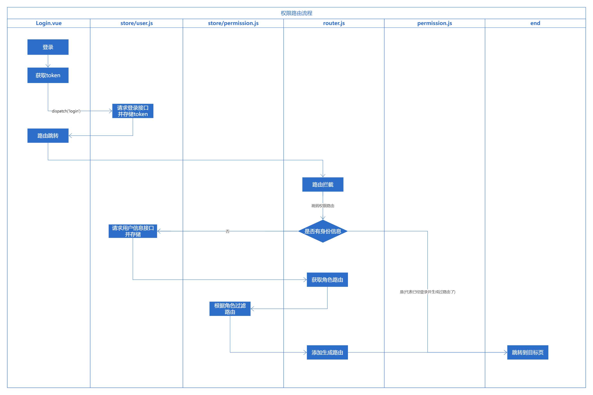

# 权限路由

## 路由设计

​	权限路由就是根据用户的角色，分配用户是否有权访问某个路由页面。当然，权限路由也区分了由前端管理和后端管理，这两种路由有什么区别呢？

- **前端路由**

  把路由全部静态的形式写在router中，可以使用路由拦截器与`meta`标记进行简单的权限路由，也可以使用`router.addRoute`进行动态路由加载。实际上它们都是在前端写好的路由表中生成，需要注意的是权限路由不单单只要在前端进行权限过滤，其实接口也是必须要进行权限校验的，毕竟前端的一切都是不安全的，可以篡改的。

  - 优点：路由表由前端管理，只需要通过角色字段进行权限分配。
  - 缺点：不可动态配置，不够灵活，每次修改了路由信息，都需要前端进行重新编写、打包编译和部署。

- **后端路由**

  把路由表交给后端处理存于数据库，后端可以提供对应的接口，进行路由表的管理，当路由表发生改变时，不需要前端重新修改和打包部署网站。

  - 优点：灵活管理各个的权限。
  - 缺点：需要后端新增路由表，编写相关的逻辑，而且前端新开发一个页面还要配一下路由和权限。

## 实现思路

1. 创建vue实例的时候将vue-router挂载，但这个时候vue-router挂载一些登录或者不用权限的公用的页面。
2. 用户登录，跳转到需要权限页面时，获取用户信息
3. 根据用户信息中的角色信息，过滤异步路由表中的路由，获得当前角色的异步路由表
4. 使用`router.addRoutes()`动态插入路由，并跳转到目标页面

## 实现具体流程图



> 注意：
>
> 在生成路由表后，不能直接next()， 而是要 next({...to, replace: true})进行路由替换重新跳转。
>
> 原因说明：
>
> 1. 路由跳转，根据目标地址从router中提取route信息，由于此时还没addRouters，所以解析出来的route是个空的，不包含组件。
> 2. 执行beforeEach钩子函数，然后内部会动态添加路由，但此时route已经生成了，不是说router.addRoutes后，这个route会自动更新，如果直接next()，最终渲染的就是空的。
> 3. 调用next({ ...to, replace: true })，会abort刚刚的跳转，然后重新走一遍上述逻辑，这时从router中提取的route信息就包含组件了，之后就和正常逻辑一样了。


## 按钮级权限管理

> 有很多人一直在问关于按钮级别粒度的权限控制怎么做。我司现在是这样的，真正需要按钮级别控制的地方不是很多，现在是通过获取到用户的role之后，在前端用v-if手动判断来区分不同权限对应的按钮的。理由前面也说了，我司颗粒度的权限判断是交给后端来做的，每个操作后端都会进行权限判断。而且我觉得其实前端真正需要按钮级别判断的地方不是很多，如果一个页面有很多种不同权限的按钮，我觉得更多的应该是考虑产品层面是否设计合理。当然你强行说我想做按钮级别的权限控制，你也可以参照路由层面的做法，搞一个操作权限表。。。但个人觉得有点多此一举。或者将它封装成一个指令都是可以的。
>
>
> 作者：花裤衩
> 链接：https://juejin.cn/post/6844903478880370701

### `v-permission`指令封装

​	一般权限控制按钮，可以直接使用`v-if`指令根据用户的角色进行判断是否渲染，但是写多了会有一个问题，就是会让模板变得难看且不那么容易理解，那么我们可以进行一个语义化的封装，将本来`v-if`的判断封装成一个指令，这样更易读而且可以写少一点代码。

### 前置知识

- 自定义指令钩子函数

  一个指令定义对象可以提供如下几个钩子函数 (均为可选)：

  **bind：**只调用一次，指令第一次绑定到元素时调用，在这里可以进行一次初始化设置；

  **inserted：**被绑定元素插入父节点时调用；

  **update：**在 bind 之后立即以初始值为参数第一次调用，之后每当绑定值变化时调用，参数为新值与旧值；

  **componentUpdated：**指令所在组件的 VNode 及其子 VNode 全部更新后调用；

  **unbind：**只调用一次，指令与元素解绑时调用；

- 自定义插件

  ```js
  MyPlugin.install = function (Vue, options) {
    // 1. 添加全局方法或 property
    Vue.myGlobalMethod = function () {
      // 逻辑...
    }
  
    // 2. 添加全局资源
    Vue.directive('my-directive', {
      bind (el, binding, vnode, oldVnode) {
        // 逻辑...
      }
      ...
    })
  
    // 3. 注入组件选项
    Vue.mixin({
      created: function () {
        // 逻辑...
      }
      ...
    })
  
    // 4. 添加实例方法
    Vue.prototype.$myMethod = function (methodOptions) {
      // 逻辑...
    }
  }
  ```


### 具体实现

  - 指令permission.js

    ```js
    import store from '@/store'
    
    // 案例： v-permission = "['admin']"
    function checkPermission(el, binding) {
      const { value } = binding
      const roles = store.getters && store.getters.roles
      // 遍历数组，查询路由角色是否匹配，存在的将节点移除
      if (value && value instanceof Array) {
        if (value.length > 0) {
          const permissionRoles = value
    
          const hasPermission = roles.some(role => {
            return permissionRoles.includes(role)
          })
    
          if (!hasPermission) {
            el.parentNode && el.parentNode.removeChild(el)
          }
        }
      } else {
        throw new Error(`need roles! Like v-permission="['admin','editor']"`)
      }
    }
    
    export default {
      inserted(el, binding) {
        checkPermission(el, binding)
      },
      update(el, binding) {
        checkPermission(el, binding)
      }
    }
    
    ```

    

  - 插件开发`permission/index.js`

    ```js
    import permission from './permission'
    
    const install = function (Vue) {
      Vue.directive('permission', permission)
    }
    
    // 兼容性处理：
    // 还要考虑通过 script引入 vue 的情况
    // 当script引入Vue时，会在window挂载Vue，此时
    if (window.Vue) {
      window['permission'] = permission // 为了在scirpt引入情况下，install内的function能够正确找到资源
      Vue.use(install); // eslint-disable-line
    }
    
    permission.install = install
    export default permission
    
    ```

- 拓展

  - VueRouter的matcher，实现替换路由