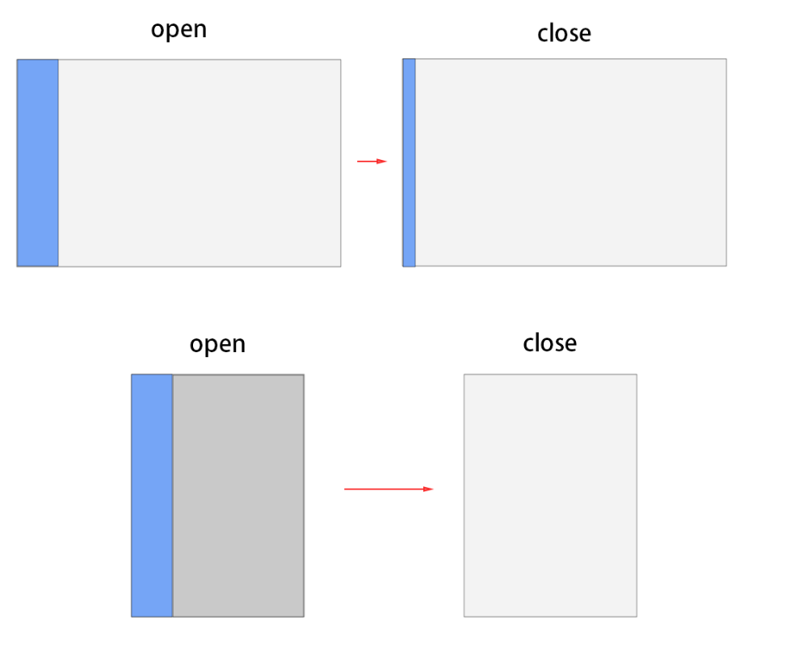
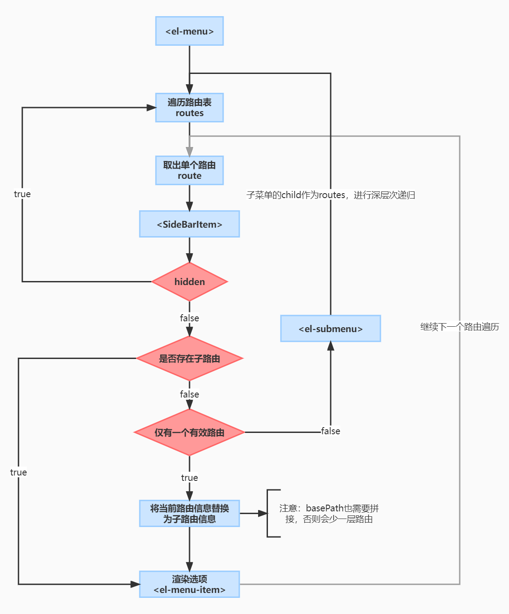

# 路由动态生成侧边栏原理与实现

## SideBar侧边栏实现分析

### 功能需求



    1. PC端侧边栏可以通过点击侧边栏控制按钮，改变侧边栏的占位宽度。
       - 展开状态：显示侧边栏选项图标及标题
       - 收缩状态：仅显示选项图标
    2. Mobile端侧边栏不占位显示，通过点击侧边栏控制按钮改变状态
       - 展开状态：显示侧边栏，并有灰色蒙层，点击蒙层可以隐藏侧边栏
       - 收缩状态：什么也不显示

### 实现分析

1. 侧边栏的占位样式设计

   - 定义一个`$sideBarWidth`控制侧边栏占位宽度。

   - 侧边栏使用`fixed`定位布局，使其浮动起来。

   - 内容区域使用`margin-left`撑开一个`$sideBarWidth`，提供给sidebar展示。

   设计说明：由于需要考虑到移动端时，侧边栏需要浮动起来，干脆直接使用定位布局，避免大量CSS的变动。

2. 切换显隐状态

   父级容器使用样式接管sidebar的显示和隐藏状态

3. 检测设备，使用不同的显示方案

   ​	使用`resize`事件，监听浏览器窗口的宽度变化`body.getBoundingClientRect()`，设计宽度阈值，达到阈值时标记为移动设备，使用`mobile`样式，进行CSS盖写实现切换状态。

## 路由动态生成侧边栏

### 功能需求

- [x] 根据路由表生成菜单
- [x] 嵌套路由渲染
- [x] 外链型菜单选项实现

### 实现思路

```
思路：
1.获取路由表(store/promise.js)
2.根据路由表，进行递归渲染组件
	路由表设置了hidden为true时，不渲染该路由的导航
	路由表中路由信息，只有一个children的时候，作为一级路由渲染导航
	
情况分析：
一、路由无child，且不需要生成导航
	路由配置hidden:true
二、路由无子节点，只有根节点
	渲染生成<el-menu-item>
三、路由需要生成导航，但只有一个“可见”child
	渲染生成<el-menu-item>
	组件使用：
        <i class="el-icon-menu"></i>
        <span slot="title">导航二</span>
四、路由由多个child组成
	1.渲染<el-submenu>生成子菜单
		菜单项使用<el-menu-item>渲染
	2.如果child-route还有child就是子菜单还包含子菜单
		递归渲染该submenu
		
注意: element-ui 导航router模式 需要配置<el-menu-item :index> index必须为路由的完整path，所以嵌套路由的子路由是需要拼接的
element-admin中的方式 是使用递归渲染时，每次都传入baseUrl用作拼接，使用path库的resolve可以确保路径的拼写正确性。
```

### 流程图



### 遇到的问题

- `submenu`关闭定位异常闪动

  解决方案：子级菜单使用`popper-append-to-body`是否将弹出菜单插入至 body 元素。在菜单的定位出现问题时，可尝试修改该属性。

  原因：由于菜单是由elementui编写的一个js动画，由于我们样式的覆盖，可能会导致offsetParent参考对象不正常，导致动画事件和样式参考对象发生变化，从而导致一些定位错误。使用`popper-append-to-body`可以让元素根据body进行参考，避免定位错误。

- 如何让`menuItem`组件跳转外链

  解决方案: 在`menuItem`外添加a标签包裹，并使用动态属性绑定，检测路由如果是外链则不绑定`index`属性（`menu`路由模式会路由跳转到`index`）。

