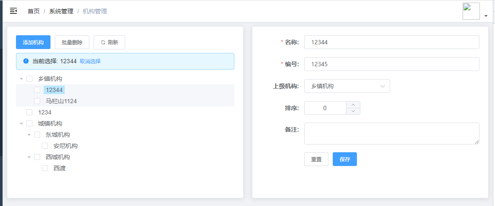
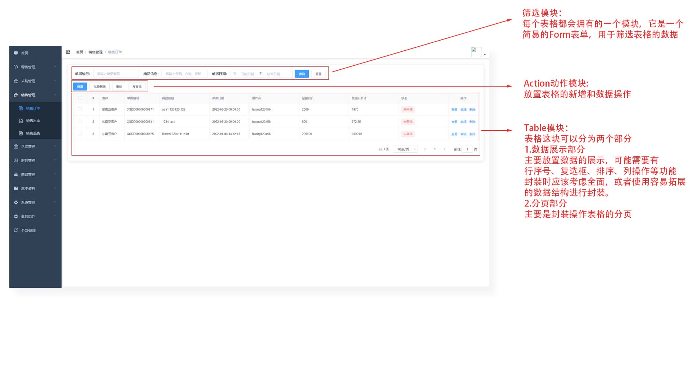

# 开发总结

# 一、前端基础架构的搭建

## 技术选型

### 前端模板

系统开发选用了`vue-element-admin`的基础模板`vue-admin-template`，模板提供的功能有

1. 响应式侧边栏以及布局
2. 简单的登录功能，退出登录
3. 面包屑功能
4. 配置式路由
5. 封装的axios请求
6. vuex的store配置（默认配置管理侧边栏，登录token，设备响应的状态变量）

## 框架

前端：vue2 + elementui（比较熟悉）

模拟数据：mockjs

单元测试：jest


# 二、功能点列表

## 全局功能

- [x] 登录
- [x] 注册
- [x] 面包屑
- [ ] tag缓存页
- [ ] 权限路由
- [x] 首页数据看板
- [x] 系统管理
  - [x] 角色管理
  - [x] 用户管理
  - [x] 机构管理
  - [x] 日志管理
  - [x] 系统配置
- [x] 基本资料
  - [x] 供应商信息
  - [x] 客户信息
  - [x] 会员信息
  - [x] 仓库信息
  - [x] 收支项目
  - [x] 结算账户
  - [ ] 经手人管理
- [x] 商品管理
  - [x] 商品类别
  - [x] 商品信息
  - [x] 计量单位
  - [x] 多属性
- [x] 仓库管理
  - [x] 其他入库
  - [x] 其它出库
  - [x] 调拨出库
  - [x] 组装单
  - [x] 拆卸单
- [x] 财务管理
  - [x] 收入单
  - [x] 支出单
  - [x] 收款单
  - [x] 付款单
  - [x] 转账单
  - [x] 收预支付
- [x] 销售管理
  - [x] 销售订单
  - [x] 销售出库
  - [x] 销售退货
- [x] 零售管理
  - [x] 零售出库
  - [x] 零售退货
- [x] 采购管理
  - [x] 采购订单
  - [x] 采购入库
  - [x] 采购退货


# 三、功能点实现细节总结

## 1. 基础设施的改造

### 1.1 登录流程修改

**模板默认的登录流程（前公司也是这样的）:**

1. 请求login登录校验
2. 获取token，存放到cookie
3. 用户进入管理平台，根据token请求user/info接口，获取用户的信息
4. 用户登出，调用logout接口
5. store的action进行用户信息的清除

**jshERP的登录流程：**

1. 请求login登录校验

2. 获取token以及用户信息

3. 持久化信息至localStorage（管理storage使用Vue.ls）

   注意：由于没有userinfo接口，所以必须持久化用户信息，才能记录用户的登录状态。再permission的路由拦截器中，增加一个校验，如果userinfo丢了，就必须重新登录。

4. 用户登出，调用logout接口

5. store的action进行用户信息的清除

**登录模块修改学习总结：**

1. 登录信息管理抽离：

   用户信息的管理，都抽离到了vuex中action或者mutation中进行信息管理，解除了前端组件模板的耦合程序，当登录流程发生变化时，基本上不用再去修改组件内容，而是去修改store中的对应的action，这点非常好。

### 1.2 Axios的二次封装

增加axios的请求拦截器

**`API`**

```javascript
// 添加请求拦截器
axios.interceptors.request.use(function (config) {
    // 在发送请求之前做些什么
    return config;
  }, function (error) {
    // 对请求错误做些什么
    return Promise.reject(error);
  });

// 添加响应拦截器
axios.interceptors.response.use(function (response) {
    // 2xx 范围内的状态码都会触发该函数。
    // 对响应数据做点什么
    return response;
  }, function (error) {
    // 超出 2xx 范围的状态码都会触发该函数。
    // 对响应错误做点什么
    return Promise.reject(error);
  });
```

**主要用途：**

1. 在请求拦截器，发送请求前，携带token信息
2. 在响应拦截器中，处理服务端响应状态码进行对应的错误提示


## 2. 数据看板实现

### 2.1 Echarts组件封装

**echarts配置**

```javascript
const option = {
    // 设置echarts的title标题
    title: {
        text: this.title,
    },
    // 浮动选项的配置
    legend: {
        right: "0",
    },
    // 绘图位置的配置
    grid: {
        left: "15%",
    },
    // 工具箱配置（鼠标移入显示系列的阴影）
    tooltip: {
        trigger: "axis",
        axisPointer: {
            type: "shadow",
        },
    },
    // x轴系列配置，配置x轴坐标对应的项目名称
    xAxis: {
        type: "category",
        // 名称配置（旋转50度）
        axisLabel: {
            inside: false,
            rotate: 50,
        },
        data: products,
    },
    // y轴配置
    yAxis: {},
    // 缩放功能配置
    dataZoom: [
        {
            type: "inside",
            // 数据窗口范围的起始百分比
            start: 0,
            // 数据窗口范围的结束百分比
            end: 100,
            // 是否锁定选择区域（或叫做数据窗口）的大小，如果设置为 true 则锁定选择区域的大小，也就是说，只能平移，不能缩放
            zoomLock: false,
        },
    ],
    // 系列配置，使用柱状图显示数据，配置系列的数据
    series: [
        {
            name: "数量",
            type: "bar",
            emphasis: {
                focus: "series",
                blurScope: "coordinateSystem",
            },
            labelLine: {
                show: true,
            },
            data: values,
            itemStyle: {
                color,
            },
        },
    ],
};
```

#### 遇到的问题总结

1. **v-if 导致ref 获取不到元素**

   **场景：**父组件进行异步数据获取，更改loading状态，再通过props传递，子组件根据loading熟悉进行图表的渲染。

   **原因：**由于异步数据未获取完成的时候，图表子组件已经挂载，此时子组件监听的loading状态为false，图表对应的元素，通过v-if挂载，此时未挂载，所以在mounted阶段无法获取到的。

   **解决方案：**

   1. **使用v-if 进行子组件的挂载**，此时子组件mounted阶段就已经拥有了父组件传递的异步请求回来的数据。
   2. **子组件中使用v-show替代v-if**（这个方案不适用与我的项目，因为我的组件要依赖异步数据来创建echats实例，在初步挂载子组件时，mounted中无法获取到父组件的异步数据，会导致无法获取到DOM元素）
   3. **(推荐) 使用watch监听异步数据的更新**，把mounted阶段的处理，放入响应回调的handler，此时可以正确的处理子组件的数据。我的组件就是监听父组件loading状态的更新，只有loading为true时（异步数据已成功获取），再进行数据的挂载与渲染。

2. **父容器设置宽度100%，echarts渲染宽度只有100px**

   **场景：**父容器设置宽度100%，echarts渲染宽度只有100px

   **原因**：由于我的元素是通过v-show控制的，在组件初始化后的mounted阶段，由于异步数据未获取成功，元素不显示，此时的宽度100%无效，echarts无法获取到元素的宽度，所以使用默认的100px宽度进行渲染。

   **解决方案：**1.（推荐）正确处理echarts初始化渲染时机，只有元素盒子计算宽度完成后再进行渲染。

   2. 使用echarts的`resize()`方法，在完成数据挂载后重算下canvas的宽度
   3. 设置固定宽度的容器。


## 3. 系统管理 - 角色管理实现

- [x] 角色列表的展示
- [x] 新增/编辑角色
- [x] 关键词搜索
- [x] 删除/批量删除
- [x] 分页
- [x] 分配功能
- [x] 分配按钮

### 模块功能分配

**`index.vue`**

**主要负责功能：**

- 数据列表表格
- 管理模态窗口的显隐（通过ref调用子组件的方法）

主要使用的组件：

- `<el-row>`、`<el-col>`
- `<el-button>`
- `<el-form>`、`<el-form-item>`
- `<el-table>`、`<el-table-column>`
- `<el-dorpdown>`、`<el-dropdown-menu>`、 `<el-dropdown-item>`

------

**`addRoleModal.vue`**

**主要负责功能：**

- 角色新增/编辑功能
- 表单项校验
- 请求完成后，通知父组件刷新列表

**主要使用的组件：**

- `<el-dialog>`
- `<el-form>`、`<el-form-item>`
- `<el-input>`、`<el-select>`、`<el-select-option>`
- `<el-button>`

------

**`AssignFunctionModal.vue`**

**主要负责功能：**

- 角色功能树的渲染
- 功能树选择
- 功能树的配置

**主要使用的组件：**

- `<el-dialog>`

- `<el-tree>`
- `<el-button>`

**难点：**

- 数据格式的剥离和转换

------

**`AssignBtnModal.vue`**

**主要负责功能：**

- 功能树选择后，对应可设置的功能按钮表格的渲染
- 分配角色可用功能按钮的权限

**主要使用组件：**

- `<el-dialog>`
- `<el-table>`、`<el-table-column>`
- `<el-checkbox-group>`、`<el-checkbox>`
- `<el-button>`

**难点:**

- 后端数据的可选项是对应的key字符串，需要把它提取后，整理到一个映射数组，然后绑定到checkbox-group上做响应式。

  例如:

  ```javascript
   // optionsData: {
   // pushStr: 可选按钮, btnStr:当前选中按钮, ...
   //}
  
  checkedOptions: {}; //checkbox-group v-model此数据做选项响应式
  
  function getCheckedOptions(){
      this.optionsData.forEach((item)=>{
          // item.btnStr => 1,2,7
          this.checkedOptions[item.key] = item.btnStr.split(',')
      })
  }
  ```


## 4. 系统管理 - 用户管理实现

- [x] 用户列表的展示
- [x] 新增/编辑用户功能
- [x] 关键词搜索
- [x] 重置用户密码
- [x] 删除/批量删除
- [x] 启动/禁用用户
- [x] 分页

### 模块功能分配

**`User/index.vue`**

**主要负责功能：**

- 用户列表的渲染
- 用户查询
- 用户的分页
- 用户的批量操作（删除、启用、禁用）
- 用户的/新增编辑
- 用户编辑、删除、重置密码

------

**`UserModal.vue`**

**主要负责功能：**

- 用户的新增
- 用户的编辑

### 难点总结

- `<SelectTree>`组件封装

  Element里面没有树形收缩类型的下拉选择，只有级联风格的下拉框，不是我需要的，所以进行了组件的二次封装。

  主要使用的是`<el-select>`、`<el-tree>`

  **封装思路：**

  使用`<el-select>`、`<el-option>`包裹`<el-tree>`组件，向外暴露所需要用到的属性，比如value值，配置props属性（主要负责对象与树节点的映射关系），在选中Tree Node调用回调方法，将数据更新到v-model绑定的动态数据中。

  组件配置

  | 属性        | 作用                       | 类型    | 必要性   | 默认配置 |
  | ----------- | -------------------------- | ------- | -------- | -------- |
  | v-model     | 双向绑定值                 | Value   | required |          |
  | props       | 对象与树映射关系           | Object  |          | 见下表   |
  | options     | 下拉选择的树形数组         | Array   | required |          |
  | accordion   | 是否只展示一个树节点里内容 | Boolean |          |          |
  | placeholder | 未选中时，展示的默认文本   | String  |          |          |

  **props配置**

  | 属性      | 作用                                     | 必要性 | 默认配置   |
  | --------- | ---------------------------------------- | ------ | ---------- |
  | valueName | select的值中以树对象中的哪个属性进行绑定 |        | 'value'    |
  | label     | select下拉框展示的文本                   |        | 'label'    |
  | children  | tree对象中子节点属性名称                 |        | 'children' |

  **问题总结：**

  1. 异步options传入，无法获取到状态，进行默认值的选中

     解决：watch options选项，当options更新并有值时，进行默认数据的映射绑定。非异步的options在mounted阶段进行关系隐射。

  2. 自己的组件如何使用v-model进行双向绑定？

     子组件可以使用`this.$attrs`查看当前组件所有bind的属性，可以通过`this.$listeners`查看当前组件所有v-on的属性。很多二次组件封装都会通过这两个属性进行透传至底层组件。此处我实现v-model双向绑定，也是利用这两个属性获取到v-model语法糖的实际绑定值是

     ```javascript
     <div v-model="value"> </div>
     //等同于
     <div :value="value" @input="update:value">
     ```

     > 注意 :Vue3中，可以通过 [Vue3 Template Explorer](https://template-explorer.vuejs.org/#eyJzcmMiOiI8ZGl2IHYtbW9kZWw9XCJ2YWx1ZTFcIj5IZWxsbyBXb3JsZDwvZGl2PiIsIm9wdGlvbnMiOnsibW9kZSI6ImZ1bmN0aW9uIn19) 进行编译模板后的代码查询

  **优化的思考**

  - **异步select数据有比较明显的闪动如何处理？**

    1.**挂载时机的把控**，尽量要在数据请求完毕后，再进行组件的渲染，可以有效防止闪动。

    2.**可以进行接口的缓存处理**，比如相同接口相同参数。也可以进行前端的请求拦截，每个请求都缓存数据，当有相同参数的请求时，调用缓存里面的数据。缺点：会导致请求接口无法更新实时数据，所以斟酌使用。

    3.**协商缓存**， 可以利用http的缓存机制，进行协商缓存，加快http的响应速度。

  - **如果不处理，那么如何优化用户的体验呢？**

    1.设置loading提醒用户正在加载，加载完毕后再显示，就不会出现明显的闪动，但是也会影响用户的体验。

  - **Table和Form很多方法以及样式布局都重复了，是否可以抽离封装成组件**

    可以进行二次封装，抽离公共方法，配置mixin，然后再加上配置，增加组件的灵活性，就可以满足整个系统的搭建，进行json式的配置，简化template的长度，更加优于管理。

## 5. 系统管理 - 机构管理实现

- [x]  机构管理选择树的展现
- [x] 新增机构
- [x] 删除/批量删除机构
- [x] 树操作列表
- [x] 编辑机构信息
- [x] `SelectTree`组件的优化

### 思考总结

#### 1.组件化如何进行划分比较好？



   **问题场景：**在编写如图页面的结构时候，起初在设计编写组件时，使用我思考的单一职能的组件划分方式进行组件拆分，使用一个index组织，左右两个部分的子组件。这样我觉得就能分开两个职能，或许代码会更容易阅读。

   但是在开发的时候，才发现，这个页面的两个部分是`强耦合`的组件，左组件选中`TreeNode`后，右边组件获取节点的id进行异步请求，获取该节点的详细信息。在编写的问题浮现出来就是，左组件与右组件要进行不必要的值传递，导致编写逻辑增加，同时也增加了组件的阅读难度。

   **问题思考：**那么我们要如何进行组件划分呢，可能是缺乏经验，在检索关键字`vue组件划分`之类关键词，并没有我想看到的相关文章的分享，只能自己做初步的分析与总结。对于如图的这种组件，我觉得`没有必要太细化组件`，粒度带来的问题就是`组件间通信的问题`。在业务组件的小组件中，优先使用一个组件进行编写。之后如果有冗余代码，`复用性高的代码`，再进行组件划分或者组件抽离。

   **总结：**业务优先不细化组件，如果重复率高后再进行组件的细化划分和抽离。

   

#### 2.`SelectTree`组件优化与封装

   **问题：**

   1. 由于之前的组件封装场景十分单一，选中树是按照element的默认风格来进行封装的，导致有些功能不符合预期，比如点击树项时，获取树节点文本信息为选中目标，选择下拉图标时不选中。
   2. 异步加载时，非常频繁的进行options树的扁平化计算，导致渲染时抖动。

   **解决：**

   1. 使用Element Tree组件的`自定义节点`，进行自定义节点模板的编写。

      ```vue
      <el-tree
        :data="data"
        show-checkbox
        node-key="id"
        default-expand-all
        :expand-on-click-node="false">
        <span class="custom-tree-node" slot-scope="{ node, data }">
          <!-- 自定义模板节点内容 --> 
          <span>{{ node.label }}</span>
        </span>
      </el-tree>
      ```

   2. 监听options的变化，比较options的值，如果不一样再进行扁平化计算。

      ```js
      // 深度比较两个对象的内容
      if (JSON.stringify(newOptions) !== JSON.stringify(oldOptions)) {
      	this.recalculate = true; // 重算标志值
      }
      ```

#### 3.二封组件遇到的样式问题以及解决

   ```
问题：scoped样式无法覆盖应用至Element组件。

原因分析：由于ElementUI的样式，是用过less进行编写的，不参与进vue的样式编译中。
        当我们使用vue的<style scoped>标签进行样式的重写
        比如说
        <style scoped>
        .tree .el-tree-node__content{
           background: pink;
        }
        </style>
        实际渲染的时的样式选择器是
        .tree[data-v-a1561321] .el-tree-node__content[data-v-a1561321]{}
        而Element组件内编写的应用样式是：
        .el-tree-node__content
        所以样式规则无法找到目标。

解决：vue的scoped样式编译规则中，有样式穿透的选项，意思就是标记为样式穿透的样式，不参与scoped插件的编译，通俗的说就是不会加上[data-v-a1561321]的属性选择器。
    样式穿透的方式：
     css：   >>>    穿透符号
     预编译: /deep/  穿透符号
最终修改：
	<style scoped>
        .tree >>> .el-tree-node__content{
           background: pink;
        }
	</style>
最终编译结果:
	.tree[data-v-a1561321] .el-tree-node__content{
		background: pink;
	}
顺利的利用穿透符号的特性，进行了样式覆盖，同时应用scoped的属性，避免了全局样式属性的干扰。完美！！
   ```

  

####  4.错误提示`Eslint`的配置

   ESLint和premitter插件的风格经常冲突，可以通过配置`eslintrc.js`进行比对，或者关闭语法检查

   ```js
   关闭语法检查
   // vue.config.js
   lintOnSave: false
   ```


## 6.业务组件抽离与封装

### 场景

在ERP系统中的零售、采购、销售、仓库、财务、商品模块页面都是基于表的增删改查，就是基于一个表格进行数据的增删改查，如果每次都选择使用Element的template写法来编写，耗时耗力需要不断重复的编写类似的代码，十分麻烦，而且写出来的模板代码也掺杂了许多模板语法，也不利于后期阅读与代码维护。此时针对这种重复的场景可以进行业务组件的抽离与封装。

### **封装什么？**

在开始封装前，都需要思考，什么代码是重复且无意义的，比如重复编写一个表格，那么我们只关心它定义的列名，渲染的table数据，以及每个列渲染的方式，我们可以思考如何从`template`写法转化为`Json schema`写法是否更为简洁（即配置式的写法，可以参考`antv`进行实现）。我们把结构抽象出去，只配置我们需要关心的“变化”部分，就更加容易阅读了。

### 为什么封装？

我们先观察一下我们需要抽离封装的页面模块的组成。



根据观察，我们每一个管理页面的组成都大致分为了以上部分，但是还是有一些部分需要定制化的实现的，比如零售、采购、销售的数据不是全部从接口中获取数据，有些需要定制化的编写实现逻辑。

**思考：**由于接口的实现和数据返回的格式都有所不同，为了`灵活性`就不能进行高度封装。但是我们可以进行常用组件的封装，简化页面的搭建过程，简化template部分的臃肿冗余的结构代码。

那么我们就需要思考哪部分是相对固定或者说可以进行抽象来完美覆盖业务实现的。很明显重复部分就是Table和Form的表单，所以我们需要抽象Table和Form组件。

### **Table组件二次封装**

#### **封装能力**

- [x] 表格渲染
- [x] 复选列配置
- [x] 序号列配置
- [x] 列配置
	- [x] 默认渲染
	- [x] 回调自定义渲染
	- [x] 插槽自定义渲染
	- [x] 表单输入类型渲染
- [x] 分页封装

#### **封装实现**

1. 默认渲染细节

   ```vue
   <el-table ...>
       <template v-for="item of columns">
       	<el-table-column
             :key="item.prop"    // 列的key
             :prop="item.prop"	  // 该列渲染data中的属性名称
             :label="item.label" // 配置该列的列名
             :width="item.width" // 配置该列的宽度
             v-bind="item.attrs" // 将传入的attrs属性，全部传递至该组件
           />
       </template>
   </el-table>
   ```

2. 插槽渲染
   使用场景：更灵活的配置渲染，比如tag标签，或者其它自定义渲染都可以使用该方式。

   ```vue
   <el-table ...>
       <template v-for="item of columns">
       	<el-table-column
             :key="item.prop"    // 列的key
             :prop="item.prop"	  // 该列渲染data中的属性名称
             :label="item.label" // 配置该列的列名
             :width="item.width" // 配置该列的宽度
             v-bind="item.attrs" // 将传入的attrs属性，全部传递至该组件
           />
   			// 使用slot获取element slot的列数据并使用bind传递至上级组件的scoped中，实现slot的传递渲染
           	<template slot-scope="scoped">
                   <slot
                     :name="item.prop"
                     :row="scoped.row"
                     :index="scoped.$index"
                   ></slot>
                 </template>
           </el-table-column>
       </template>
   </el-table>
   ```

3. 回调渲染

   使用场景：需要对列数据进行一步计算时候可以使用。

   ```vue
   <el-table ...>
       <template v-for="item of columns">
       	<el-table-column
             :key="item.prop"    // 列的key
             :prop="item.prop"	  // 该列渲染data中的属性名称
             :label="item.label" // 配置该列的列名
             :width="item.width" // 配置该列的宽度
             v-bind="item.attrs" // 将传入的attrs属性，全部传递至该组件
           />
   			// 使用v-html实现调用回调获取回调结果并渲染至template中
           	<template slot-scope="scoped">
                   <div v-html="item.callback && item.callback(scoped.row)"></div>
                 </template>
           </el-table-column>
       </template>
   </el-table>
   ```

   

#### **封装使用**

`template`

```vue
<MkTable
    :columns="columns" // 列配置
    :data="tableData"  // 渲染的表格数据
    index			   // 是否开启序号列
    checkbox		   // 是否使用复选列
    @selection-change="handleSelectionChange"	// 复选列选项被选中时触发
    @sort-change="handleSortChange"				// 排序
    :pagination="pagination"					// 分页功能的配置
    @size-change="handleSizeChange"				// 分页-分页size的选择触发事件
    @current-change="handleCurrentChange"		// 分页-当前分页改变触发事件
>
    <template #tag="scoped">
        <el-tag size="medium">{{ scoped.row.tag }}</el-tag>
    </template>
</MkTable>
```

`script`

```javascript
{
    data:() =>{
        return {
          // 1.列配置
          columns: [
            // 默认配置
            {
              prop: "name",
              label: "姓名",
            },
            { prop: "address", label: "地址" },
            // 回调函数自定义渲染
            {
              type: "function",
              prop: "date",
              label: "日期",
              callback: (row) => {
                return row.date + "-<strong>new</strong>";
              },
              attrs: { sortable: true, "sort-by": "aaa" },
            },
            // 插槽渲染自定义内容
            {
              type: "slot",
              prop: "tag",
              label: "标签",
            },
          ],
          // 2.数据源，根据columns的prop进行对应属性的渲染
          tableData: [],
          // 3.分页配置
          pagination: {
            pageSize: 50,
            total: 400,
            currentPage: 1,
          },
        }
    }
}
```


### Form组件二次封装

#### 封装能力

- [x] 配置式的生产表单

- [x] 不同类型的表单项实现

	- [x] input
- [x] input-number
  - [x] password
  - [x] select
  - [x] checkbox
  - [x] date
  - [x] radio
  - [x] switch
  - [x] textarea
  - [x] select-tree
  - [x] 自定义插槽slot
  

#### **封装实现**

```vue
<el-form
      :model="form"
      :rules="rules"
      ref="commonForm"
      :label-width="labelWidth"
      :label-position="labelPosition"
      label-suffix=":"
      :inline="inline"
>
	<el-form-item
        v-for="(item, field) in fields"
        :key="item.key"
        :label="item.label"
        :prop="item.key"
        v-bind="item.attrs"
      >
        //...各种类型的实现
        <template v-if="item.type === 'password'">
        	// ...组件
        </template>
    </el-form-item>
</el-form>
```

#### 封装使用

`template`

```vue
<MkForm ref="form" :fields="fields" :form="operateForm">
    // slot
    <el-button type="primary" @click="onSubmit">提交</el-button>
    <el-button @click="onReset">重置</el-button>
</MkForm>
```

```json
{
	// 表单配置对象
      fields: {
        // input类型
        name: {
          label: "活动名称",
          key: "name",
          type: "input",
          rules: [
            { required: true, message: "请输入活动名称", trigger: "blur" },
            {
              min: 3,
              max: 5,
              message: "长度在 3 到 5 个字符",
              trigger: "blur",
            },
          ],
          style: {
            width: "50%",
          },
        },
        // password类型
        password: {
          label: "活动密码",
          key: "password",
          type: "password"
        },
        // select下拉框类型
        region: {
          label: "活动区域",
          key: "region",
          type: "select",
          options: [
            {
              value: "选项1",
              label: "黄金糕",
            },
            {
              value: "选项2",
              label: "双皮奶",
            }
          ],
        },
        // 日期选择类型
        date: {
          label: "活动时间",
          key: "date",
          type: "date",
        },
        // 开关类型
        delivery: {
          label: "即时配送",
          key: "delivery",
          type: "switch",
        },
        // 复选框类型
        type: {
          label: "活动性质",
          key: "type",
          type: "checkbox",
          options: [
            { label: "美食/餐厅线上活动", value: 0 },
            { label: "地推活动", value: 1 },
            { label: "线下主题活动", value: 2 },
            { label: "单纯品牌曝光", value: 3 },
          ],
        },
        // 单选类型
        resource: {
          label: "特殊资源",
          key: "resource",
          type: "radio",
          options: [
            { label: "男", value: 0 },
            { label: "女", value: 1 },
            { label: "保密", value: 2 },
          ],
        },
        // 文本框类型
        desc: {
          label: "活动形式",
          key: "desc",
          type: "textarea"
        },
        // select-tree类型
        organization: {
          label: "下拉树",
          key: "organization",
          type: "select-tree",
          options: [
            // ....
          ],
          optionsProps: {
            valueName: "value",
            label: "title",
            children: "children",
          },
        },
      },
      // 表单
      form: {
        name: "",
        password: "",
        region: "",
        date: "",
        delivery: false,
        type: [],
        resource: "",
        desc: "",
        organization: "",
      },
}
```


