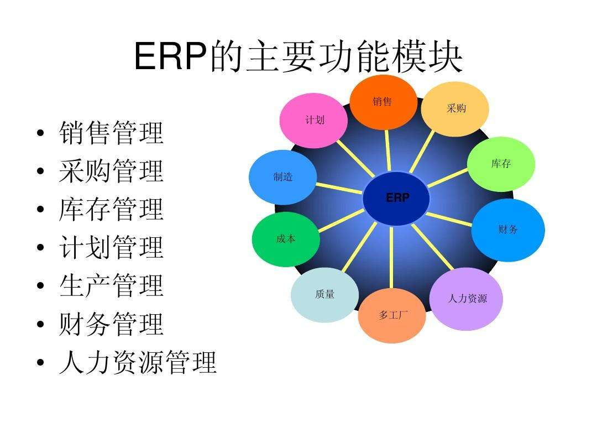

# 什么是ERP系统？

## ERP系统简介

​	`erp`是企业资源计划(`Enterprise Resource Planning`)的简称，是可以为企业员工及决策层提供决策手段的管理平台。**ERP是一个庞大的数据库管理，涉及到方方面面，主要有财务管理、会计核算、生产控制管理、采购管理、库存控制等八大模块**。

1、财务管理模块

企业的财务管理人员可通过ERP系统中的决策支持智能系统，全面了解和掌握企业的经营状况，准确的分析和制定企业的发展方向，有效的控制和降低企业的运作成本。同时，企业的中层管理者可以通过ERP系统安排好相应的采购计划、生产计划、销售计划和资金计划。并且企业的基层管理者可以通过ERP系统操作下达日常的工作指令。

2、会计核算模块

传统的会计核算是通过人工记录来实现的，这样不仅对准确率和记录速度有影响，在查找某一数据的时候也不太方便。ERP系统的会计核算结合信息技术，对企业的会计相关数据进行统一管理并自动整合，减少了人工组织的环节，实现整个企业供应链的有效管理。

3、生产控制管理模块

生产控制管理是一个以计划为导向的先进的生产、管理方法。首先，企业确定它的一个总生产计划，再经过系统层层细分后，下达到各部门去执行。它将企业的整个生产过程有机的结合在一起，使得企业能够有效的降低库存，提高效率。同时各个原本分散的生产流程的自动连接，也使得生产流程能够前后连贯的进行，而不会出现生产脱节，耽误生产交货时间。

4、采购管理模块

采购是企业控制成本的一个重要方面，ERP系统的采购管理可以为企业确定合理的订货量、优秀的供应商和保持最佳的安全储备。能够随时提供订购和验收的信息，跟踪和催促外购或委托加工的无聊，保证货物及时到达。还可以建立供应商的档案，用最新的成本信息来调整库存成本。

5、库存控制模块

库存管理是企业中的一个小模块，经常会被企业管理者忽视，但是如果疏于管理也会对企业造成不小的影响。ERP系统的库存控制会结合其他模块的数据对企业的库存进行合理的控制。在保证生产所需的物资供应充足的同时避免企业的库存积压。

6、分销管理模块

销售是企业实现利润的环节，ERP系统的分销管理是从产品的销售计划开始，对其销售产品、销售地区、销售客户各种信息的管理和统计，并可对销售数量、单价、金额、利润、绩效、客户服务做出全面的分析。分销管理大致分为对客户信息的管理、对销售订单的管理、对销售的统计这几块。

7、物流管理模块

物流活动贯穿了商品产供销的全过程，且将企业与供应商以及客户有机结合在一起。由此可见，物流管理不管是对企业内部的管理还是企业外部的沟通都有很大的作用，实现了物质资源在空间上的高效流动，为企业带来巨大经济效益。

8、人力资源管理模块

无论是哪个行业，无论是国内还是国外，现在都非常重视人力资源的管理，毕竟人才才是企业的核心竞争力。ERP系统中的人力资源管理模块能够帮助企业有效的发掘人才，选拔人才，管理人才，降低成本，加强企业的核心竞争力。