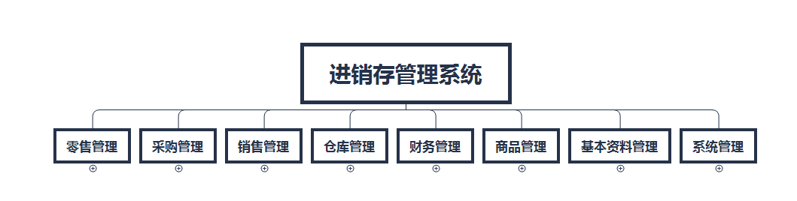

# 功能模块需求分析

​	由于目前ERP系统并非完善的ERP系统，目前只做了进销存管理与财务模块相关功能，根据目前后台功能设计，进行前端需求的分析。实现了主要的功能模块如下图。

## 零售管理

| 模块     | 模块说明                                                   |
| -------- | ---------------------------------------------------------- |
| 零售出库 | 用于非会员和会员的单据录入，主要是用于散户使用，不能欠款。 |
| 零售退货 | 用于零售出库单据的退货。                                   |

## 采购管理
| 模块     | 模块说明                                                     |
| -------- | ------------------------------------------------------------ |
| 采购订单 | 采购订单不涉及入库仓库和付款金额，采购订单可以转采购入库单，但需要先对采购订单进行审核。 |
| 采购入库 | 采购入库单可以由采购订单转过来，也可以单独创建。采购入库单据中的仓库列表只显示当前用户有权限的仓库。采购入库单可以使用多账户付款。 |
| 采购退货 | 用于采购入库单据的退货。                                     |

## 销售管理

| 模块     | 模块说明                                                     |
| -------- | ------------------------------------------------------------ |
| 销售订单 | 销售订单不涉及出库仓库和收款金额，销售订单可以转销售出库单，但需要先对销售订单进行审核。 |
| 销售入库 | 销售出库单可以由销售订单转过来，也可以单独创建。销售出库单据中的仓库列表只显示当前用户有权限的仓库。销售出库单可以使用多账户收款。 |
| 销售退货 | 用于销售出库单据的退货。                                     |

## 仓库管理

| 模块   | 模块说明                     |
| ------ | ---------------------------- |
| 入库单 | 用于库存初始化、盘点库存等。 |
| 出库单 | 用于盘点库存、给商品报废等。 |

## 财务管理

| 模块     | 模块说明                                                     |
| -------- | ------------------------------------------------------------ |
| 收入单   | 收入单主要处理一些销售收入以外的收入如维修服务收入、利息收入、调账收入等。 |
| 支出单   | 支出单主要处理一些进货支出以外的支出如水电支出、房租支出等。 |
| 收款单   | 收款单所收金额只对付款单位的应收应付产生影响，可以在回款统计中进行查看。收款单的优惠金额会对利润产生影响，但不影响付款单位的应收应付。优惠金额计入收入类的收款优惠中。 |
| 付款单   | 付款单的要素和录入原则与“收款单”相同。付款单中优惠金额计入支出类中的付款优惠中，为负值 （因优惠意味着实际少付款）。 |
| 转账单   | 转账：本系统的转账是指从一个银行存款账户转入到另一个银行存款账户。 |
| 收预付款 | 针对会员模块，对会员收取预付款。                             |

## 商品管理

| 模块     | 模块说明                                                     |
| -------- | ------------------------------------------------------------ |
| 商品类别 | 给商品信息配置具有树形目录分类，最高支持3级分类。            |
| 商品信息 | 支持导入导出、启用禁用、支持序列号商品、能够配置多单位、能够配置扩展信息。 |
| 计量单位 | 可以配置多单位信息。                                         |
| 多属性   | 配置商品的规格、颜色、制造商等信息是否启用，也可以修改别名和排序。 |

## 基本资料管理

| 模块       | 模块说明                                                     |
| ---------- | ------------------------------------------------------------ |
| 供应商信息 | 支持导入导出、启用禁用、支持配置税率，查看期初和期末的应收、应付金额。 |
| 客户信息   | 支持导入导出、启用禁用、支持配置税率，查看期初和期末的应收、应付金额。 |
| 会员信息   | 会员主要用于零售模块、收预付款模块。                         |
| 仓库信息   | 可以设置仓库负责人、设为默认仓库、设置排序。                 |
| 收支项目   | 收支项目便于用户对收入和支出进行分类管理。                   |
| 结算账户   | 用户可以设置多个不同的结算账户，用于不同的管理需求，例如：现金、转账、汇款等。 |
| 经手人管理 | 可以设置业务员、财务员、仓管员。                             |

## 系统管理

| 模块     | 模块说明                                               |
| -------- | ------------------------------------------------------ |
| 角色管理 | 配置角色，可以分配功能、分配按钮。                     |
| 机构管理 | 用于配置组织机构，在用户模块会使用到。                 |
| 用户管理 | 配置系统的用户，可以给其配置角色、配置仓库、配置客户。 |
| 日志管理 | 用于记录系统的操作日志。                               |
| 系统配置 | 可以配置系统的公司名称、联系人、公司地址、公司电话等。 |

