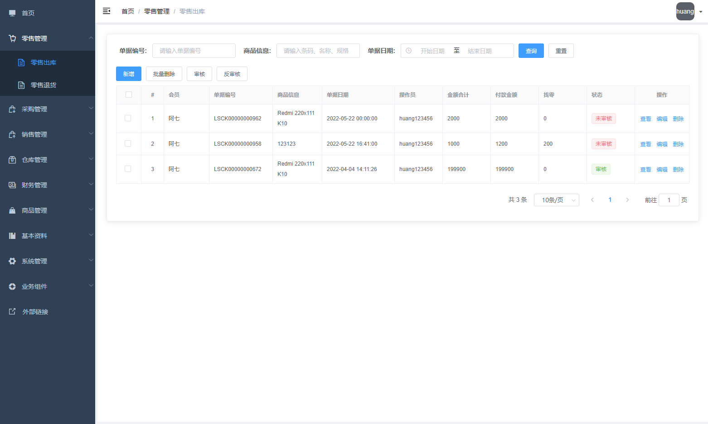
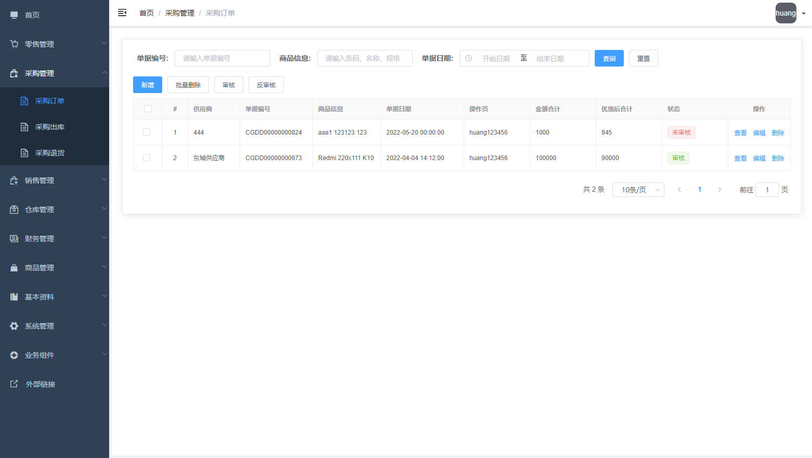
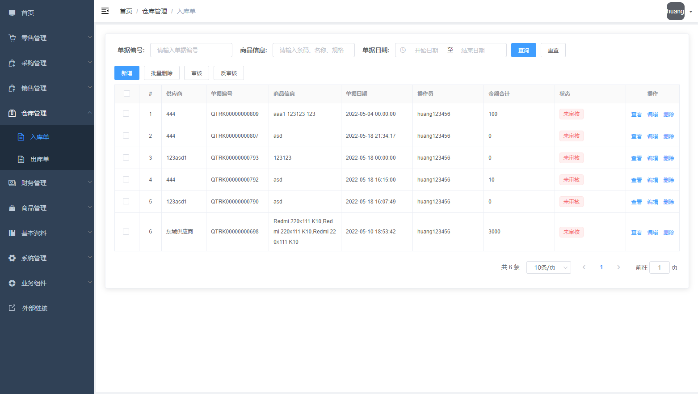
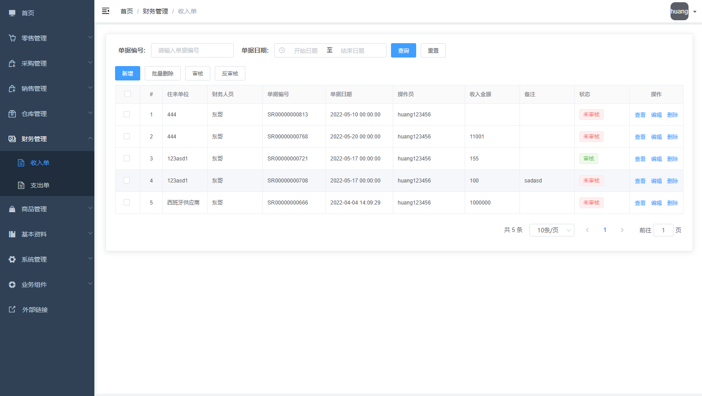
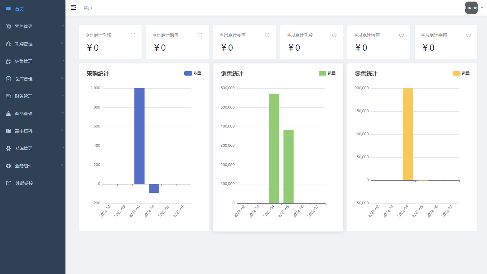
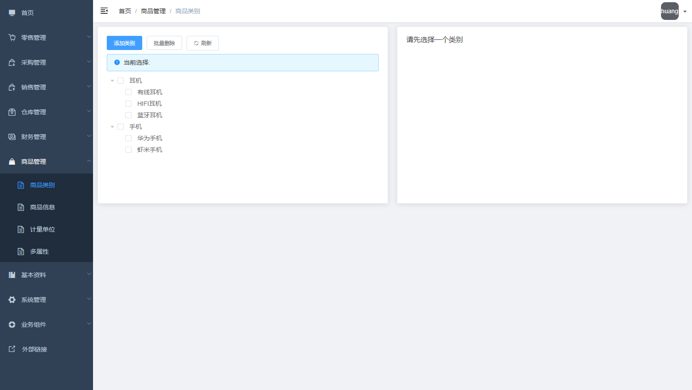
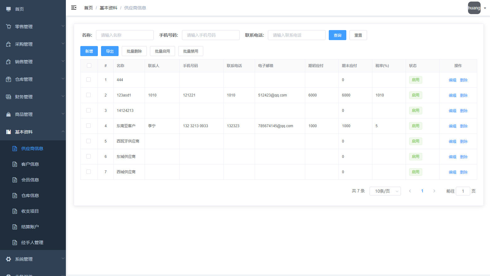
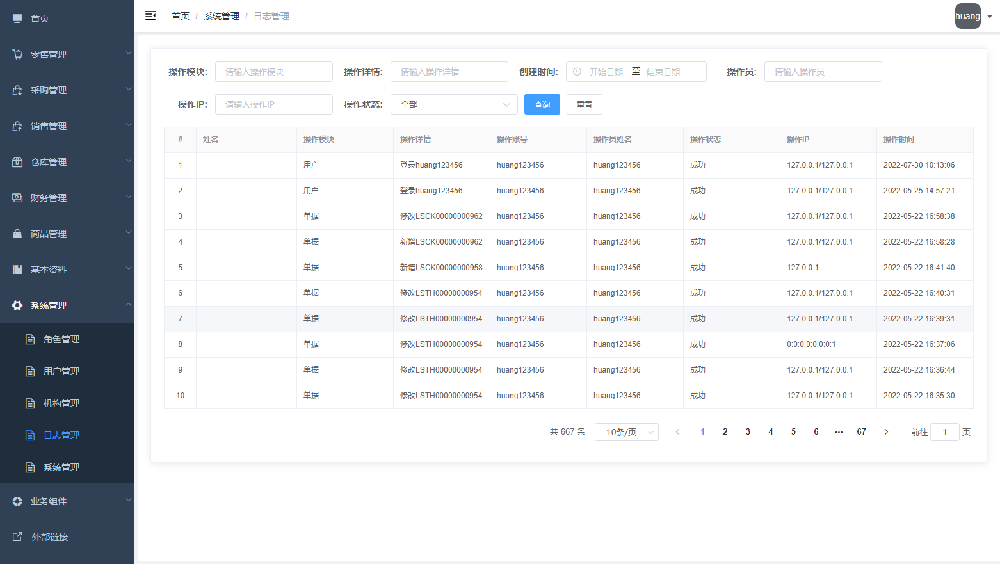

# WRAM ERP

## 项目简介

​	`WRAM ERP`项目是基于开源系统华夏ERP的二次开发项目，在ERP系统的后端基础上，重写了前端部分代码，本项目用作ERP相关系统开发学习使用。ERP系统包含了进销存+财务+生产的功能，其业务涵盖了大部分ERP管理系统的前端开发工作，也是我学习开发此项目的目的。

## 前端技术选型

| 技术               | 版本    | 说明                                                 |
| ------------------ | ------- | ---------------------------------------------------- |
| vue.js             | 2.6.7   | 用于构建用户界面的渐进式前端框架。                   |
| vue-admin-template | 4.4.0   | 极简的 vue admin 管理后台模板。                      |
| element            | 2.13.2  | 基于Vue2的UI框架                                     |
| sass/scss          | 0.0.7   | Sass/Scss 是一款强化 CSS 的辅助工具。                |
| node.js            | 14.16.0 | Node.js 是一个开源和跨平台的 JavaScript 运行时环境。 |

## 项目演示

线上访问地址：[点击访问](http://81.71.88.2:3000/)

测试账号：

- 用户名：`huang123456`

- 密码：`huang123456`

## 项目截图

1. 零售管理

   

2. 采购管理

   

3. 销售管理

   

4. 仓库管理

   

5. 财务管理

   

6. 报表查询

   

7. 商品管理

   

8. 基本资料

   

9. 系统管理

   